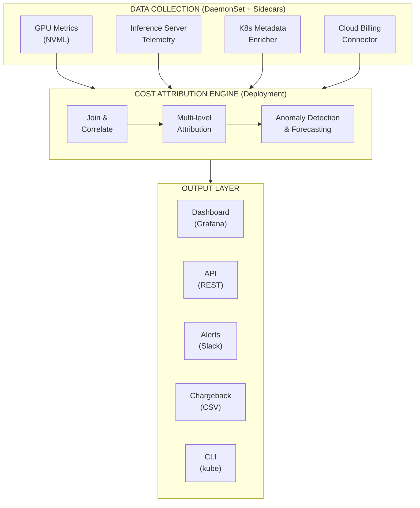

# Ballast

**K8s-native GPU inference cost attribution platform.**

Ballast answers the question every platform team running GPU inference asks: *"What is each pod actually costing us right now?"*

It collects GPU metrics via NVML, maps them to Kubernetes pods, multiplies by your configured GPU pricing, and exposes per-pod cost as a Prometheus metric — no external SaaS dependency required.

```
$ kubectl cost top pods --all-namespaces
NAMESPACE   POD                    GPU_TYPE     GPU_UTIL  COST/HR
search      llm-serve-abc-12345    NVIDIA H100  67%       $2.61
search      llm-serve-abc-67890    NVIDIA H100  42%       $1.64
recommend   rec-serve-xyz-11111    NVIDIA A100  55%       $0.99
batch       training-job-99999     NVIDIA L4    95%       $0.62
```

## Features

- **Per-pod GPU cost** — `ballast_pod_cost_per_hour_usd` Prometheus metric with pod/namespace/node/gpu_type labels
- **GPU metrics** — utilization, memory, power, temperature per GPU, mapped to owning pods
- **Inference telemetry** — sidecar scrapes vLLM and TGI token counts and re-exposes with pod labels
- **Cost attribution engine** — multi-level attribution with anomaly detection and forecasting
- **Budget enforcement** — `InferenceBudget` CRD with Slack and PagerDuty alerting
- **Cloud billing connectors** — AWS and GCP pricing integration
- **REST API** — query cost attribution data programmatically
- **kubectl plugin** — `kubectl cost top pods`, `summary`, and `export` subcommands
- **Grafana dashboard** — import-ready JSON with cost tables, utilization heatmaps, namespace breakdowns
- **Helm chart** — single `helm install` on any GPU K8s cluster
- **Minimal footprint** — DaemonSet targets <50 MB RAM, <0.1 CPU core per node

## Architecture



**Implemented:** GPU collector DaemonSet, inference sidecar, kubectl plugin, Grafana dashboard, attribution engine, REST API, budget controller with alerting, cloud billing connectors.

## Quick Start

### Prerequisites

- Kubernetes cluster with NVIDIA GPU nodes
- NVIDIA GPU Operator or device plugin installed
- Helm 3
- Prometheus (for scraping — any Prometheus-compatible stack works)

### Install

```bash
helm install ballast deploy/helm/ballast \
  --namespace ballast --create-namespace
```

The collector DaemonSet will start on every GPU node and expose metrics on port 9400.

**GKE note:** The default `nvidiaDriverPath` is set for GKE (`/home/kubernetes/bin/nvidia`). For k3s, EKS, or kubeadm clusters, override it:

```bash
helm install ballast deploy/helm/ballast \
  --namespace ballast --create-namespace \
  --set collector.nvidiaDriverPath=/usr/local/nvidia
```

### Verify

```bash
# Check the collector pods are running
kubectl get pods -n ballast -l app.kubernetes.io/component=collector

# Port-forward and check metrics
kubectl port-forward -n ballast svc/ballast-collector 9400:9400
curl -s http://localhost:9400/metrics | grep ballast_pod_cost
```

### Configure GPU Pricing

Edit `values.yaml` or pass `--set` flags:

```bash
helm install ballast deploy/helm/ballast \
  --set pricing.gpu_types.NVIDIA-H100-SXM5-80GB.cost_per_hour_usd=3.90 \
  --set pricing.gpu_types.NVIDIA-A100-SXM4-80GB.cost_per_hour_usd=1.80
```

Default pricing is included for H100, A100 (80GB/40GB), L4, T4, and V100. Keys are normalised to match NVML device names (dashes/underscores become spaces, case-insensitive).

### kubectl Plugin

```bash
# Build and install
go build -o kubectl-cost ./cmd/kubectl-cost
mv kubectl-cost /usr/local/bin/

# Use it
kubectl cost top pods --all-namespaces
kubectl cost top pods -n search
kubectl cost summary --period 7d
kubectl cost export --format csv --period this-month
```

### Grafana Dashboard

Import `deploy/grafana/ballast-dashboard.json` into Grafana. Select your Prometheus data source when prompted.

The dashboard includes:
- Per-pod cost table with GPU type, utilization, memory, and power
- GPU utilization heatmap by node
- Total cluster GPU spend over time (with per-namespace breakdown)
- Cost breakdown by namespace (donut chart)
- Utilization and power draw time series

<!-- TODO: Add screenshots once running on a real cluster -->

### Inference Sidecar (Optional)

For vLLM or TGI token-level metrics, add the sidecar to your inference pods:

```bash
# Enable sidecar auto-injection
helm upgrade ballast deploy/helm/ballast --set sidecar.enabled=true

# Label pods for injection
kubectl label pod llm-serve-abc ballast.io/inject-sidecar=true
```

Or add the sidecar container manually — it scrapes `localhost:8000/metrics` and re-exposes on port 9401 with `ballast_inference_` prefix.

## Metrics Reference

### Collector (port 9400)

| Metric | Type | Labels | Description |
|--------|------|--------|-------------|
| `ballast_gpu_utilization_percent` | gauge | gpu_uuid, pod, namespace, node | GPU compute utilization (0-100) |
| `ballast_gpu_memory_used_bytes` | gauge | gpu_uuid, pod, namespace, node | GPU memory in use |
| `ballast_gpu_memory_total_bytes` | gauge | gpu_uuid, pod, namespace, node | Total GPU memory |
| `ballast_gpu_power_watts` | gauge | gpu_uuid, pod, namespace, node | GPU power draw |
| `ballast_gpu_temperature_celsius` | gauge | gpu_uuid, pod, namespace, node | GPU temperature |
| `ballast_pod_cost_per_hour_usd` | gauge | pod, namespace, node, gpu_type | Estimated hourly cost |

### Sidecar (port 9401)

| Metric | Type | Labels | Description |
|--------|------|--------|-------------|
| `ballast_inference_prompt_tokens_total` | counter | pod, namespace, node, model_name | Cumulative input tokens |
| `ballast_inference_generation_tokens_total` | counter | pod, namespace, node, model_name | Cumulative output tokens |
| `ballast_inference_requests_total` | counter | pod, namespace, node, model_name | Completed requests |
| `ballast_inference_requests_running` | gauge | pod, namespace, node, model_name | In-flight requests |
| `ballast_inference_gpu_cache_usage_percent` | gauge | pod, namespace, node, model_name | KV-cache utilization |
| `ballast_inference_generation_throughput_tokens_per_second` | gauge | pod, namespace, node, model_name | Average generation throughput |

## Project Structure

```
cmd/
  collector/       DaemonSet binary (GPU metrics + Prometheus)
  sidecar/         Inference telemetry sidecar
  kubectl-cost/    kubectl plugin (top pods, summary, export)
  engine/          Attribution engine
  controller/      Budget controller
pkg/
  collector/       NVML wrapper, PodResources client, PID mapper, metrics loop
  telemetry/       vLLM + TGI scraper, inference exporter
  billing/         GPU pricing providers (static, AWS, GCP)
  models/          Core data types and CRD types
  attribution/     Cost attribution engine, aggregator, storage
  enforcement/     Budget controller, webhook, alerting (Slack, PagerDuty)
  api/             REST API server with middleware
  enricher/        K8s metadata cache
deploy/
  helm/            Helm chart
  grafana/         Grafana dashboard JSON
api/
  v1alpha1/        CRD type definitions (InferenceBudget, InferenceCostReport)
config/
  crd/             CRD YAML manifests
  samples/         Sample CR manifests
docs/
  design.md        Architecture and design document
hack/
  dev-cluster.sh   Development cluster setup
  test-e2e.sh      End-to-end test runner
```

## Development

```bash
# Build all binaries
make build

# Run tests
make test

# Build Docker images (use --platform for cross-compilation on Apple Silicon)
docker build --platform linux/amd64 -f Dockerfile.collector -t ballast-collector:latest .
docker build --platform linux/amd64 -f Dockerfile.engine -t ballast-engine:latest .
docker build --platform linux/amd64 -f Dockerfile.controller -t ballast-controller:latest .

# Lint
make lint
```

## Contributing

1. Fork the repository
2. Create a feature branch (`git checkout -b feature/my-feature`)
3. Make your changes with tests
4. Ensure `make test` and `make lint` pass
5. Commit with a descriptive message
6. Open a pull request

### Guidelines

- Follow standard Go project layout
- Use interfaces for testability (especially NVML and K8s clients)
- Prometheus metrics use the `ballast_` prefix
- Wrap errors with `fmt.Errorf("context: %w", err)`
- Use `slog` for structured logging
- Keep the collector DaemonSet footprint minimal (<50 MB RAM, <0.1 CPU)

## License

Apache 2.0
